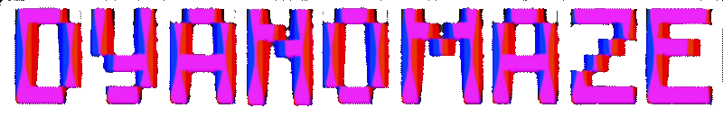

 

**DYANOMAZE** is a 3D arcade survival game built with the Godot Engine.

It combines precision platforming with melee combat, challenging players to navigate a maze of dynamically shifting pillars.

Their journey is hammered with enemy ghosts and a spooky dune-like environment

Points are tallied for powerups obtained, enemies killed and distance traveled from spawn

### <b> <u> GAMEPLAY </b> </u>

### 
 <b> THE AESTHETIC </b>

 
